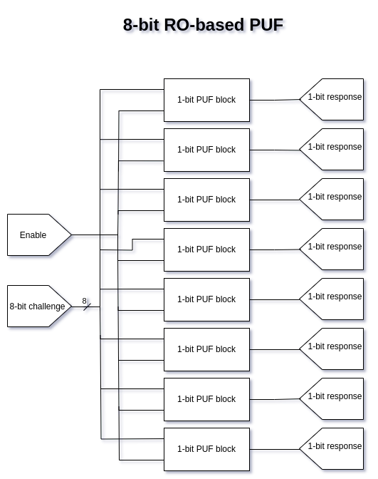
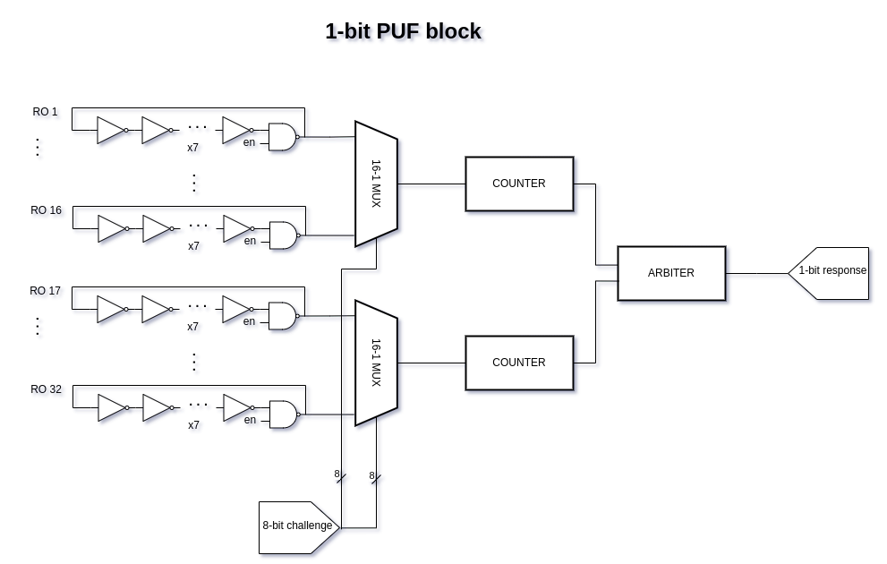

   

# Tiny Tapeout 07 - RO-based Physically Unclonable Function (PUF)

Implementation of a Ring Oscillator-based Physically Unclonable Function (PUF) in Sky130, with 8 bits of Challenge-Response Pairs (CRP). Based on one of the architectures found in https://github.com/Crimsonninja/senior_design_puf .

## Introduction

A physical unclonable function (PUF) is a hardware primitive that maps an input (called a challenge) to an output (called a response) in a similar fashion to a hash function. The goal of a PUF can be many: uniquely identifying an integrated circuit (IC) from another while still keeping deterministic outputs for the same IC, using a set of challenge-response pairs (CRP); generating random-enough nonces; or even authenticating an IC (stronger version of identification). In order to evaluate its performance for those goals, relevant metrics such as **uniqueness**, **reliability**, **uniformity** and **entropy** of CRPs over many PUF ICs are commonly employed. The PUF implementation for this project uses many identical, 7-inverter ring oscillators (RO) which introduce randomness or variation in their operating frequencies at the time of the fabrication process itself. 

In this case, an 8-bit parallel architecture for each bit of a CR
P is adopted. The 8-bit challenge is shared along 8 independent blocks in order to derive only 1-bit of the response per block. One PUF block contains 32 ROs, where one RO is selected between the top half of the ROs over a challenge-dependent 16-bit mux, while other RO is selected from the remaining bottom half over the second chall-dependent 16-bit mux. Then, both muxes connect directly to 1 counter of its own. Both of the counters then race each other until a given threshold (65535 in this case) is reached, and an arbiter module that's connected to both counters declares the winner in a 1-bit response.

## Help needed!

In order to accurately estimate entropy, uniqueness, reliability and uniformity for this PUF architecture in Sky130, **a lot** of measurements must be taken to ensure unbiased representation of data and validity of the metric's results. That's why the module's author needs you, **a Tiny Tapeout board owner**, to join in this open-source effort of characterizing this manufacturing process and PUF architecture. The required data to collect would be the set of all possible 8-bit Challenge-Response Pairs (CRP) generated by your specific device. The plan is to make this data and the metrics transparent and public, updating them in real time.

**More information in how to help to come soon!**

## How to use

Start by feeding an 8-bit challenge to the 8 input pins in the Tiny Tapeout board before enabling or selecting this module. This will ensure that the appropiate input data is sampled while initiating the ring oscillators. After some milliseconds, a result should appear at the 8 output pins as individual response bits. To generate another CRP without powering-off the board, first start sending the new challenge on the input pins continously. After it, drive the reset pin high and then immediately low in order to sample the newest input values. Note that the output or responses **may** change as the device reaches operational temperature, after which they will become consistent. This instability is due to the ROs' sensitivity to temperature, which will slightly change frequency operation.

## What is Tiny Tapeout?

Tiny Tapeout is an educational project that aims to make it easier and cheaper than ever to get your digital and analog designs manufactured on a real chip.

To learn more and get started, visit https://tinytapeout.com.

## Set up your Verilog project

1. Add your Verilog files to the `src` folder.
2. Edit the [info.yaml](info.yaml) and update information about your project, paying special attention to the `source_files` and `top_module` properties. If you are upgrading an existing Tiny Tapeout project, check out our [online info.yaml migration tool](https://tinytapeout.github.io/tt-yaml-upgrade-tool/).
3. Edit [docs/info.md](docs/info.md) and add a description of your project.
4. Adapt the testbench to your design. See [test/README.md](test/README.md) for more information.

The GitHub action will automatically build the ASIC files using [OpenLane](https://www.zerotoasiccourse.com/terminology/openlane/).

## Enable GitHub actions to build the results page

- [Enabling GitHub Pages](https://tinytapeout.com/faq/#my-github-action-is-failing-on-the-pages-part)

## Resources

- [FAQ](https://tinytapeout.com/faq/)
- [Digital design lessons](https://tinytapeout.com/digital_design/)
- [Learn how semiconductors work](https://tinytapeout.com/siliwiz/)
- [Join the community](https://tinytapeout.com/discord)
- [Build your design locally](https://docs.google.com/document/d/1aUUZ1jthRpg4QURIIyzlOaPWlmQzr-jBn3wZipVUPt4)

## What next?

- [Submit your design to the next shuttle](https://app.tinytapeout.com/).
- Edit [this README](README.md) and explain your design, how it works, and how to test it.
- Share your project on your social network of choice:
  - LinkedIn [#tinytapeout](https://www.linkedin.com/search/results/content/?keywords=%23tinytapeout) [@TinyTapeout](https://www.linkedin.com/company/100708654/)
  - Mastodon [#tinytapeout](https://chaos.social/tags/tinytapeout) [@matthewvenn](https://chaos.social/@matthewvenn)
  - X (formerly Twitter) [#tinytapeout](https://twitter.com/hashtag/tinytapeout) [@tinytapeout](https://twitter.com/tinytapeout)
